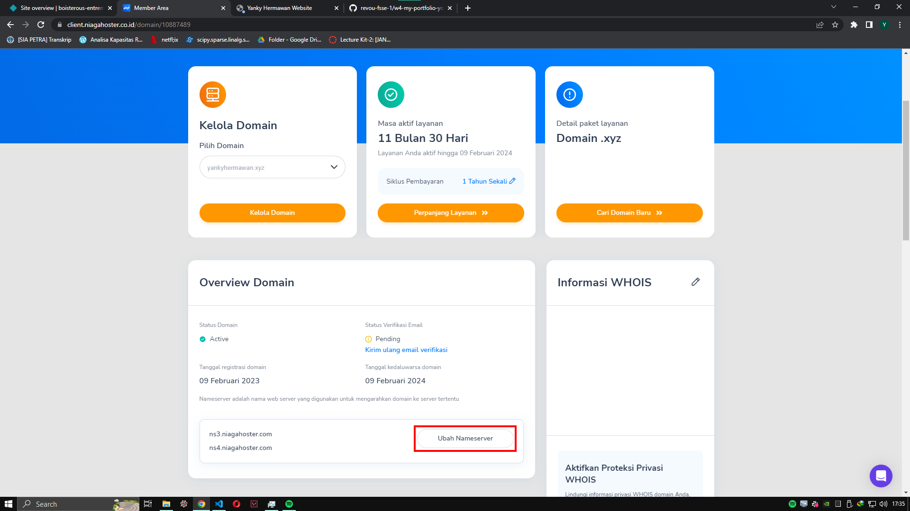

# Deploying Website on Netlify and Custom Domain

## Deploying Website on Netlify

1. Open [Netlify](https://www.netlify.com) and click log in or sign up

2. Choose account for log in or sign up

3. After log in success, click "Sites" --> "Add New Sites" --> "Import an existing project"

4. Click on GitHub for import an existing project

5. Pick a repository from GitHub

6. Click "Deploy site"

7. After a while, your site has deployed successfully

## Using Custom Domain

1. Open [Niagahoster](https://client.niagahoster.co.id/) and scroll down until you find domain search bar. Type domain name you want then click search

2. After search domain name, niagahoster will check availability of the domain name, and choose domain you want

3. Make a payment

4. Change nameserver on niagahoster

5. Update nameserver1: ns3.niagahoster.com and nameserver2: ns4.niagahoster.com and click "Save"

6. Scroll down to DNS Management section and click "Manage DNS Record"

7. Click on the drop down option and choose "Add New DNS Record"

8. Choose CNAME from the option

Scroll down and fill the blank (Sub Domain : "www", Hostname: your netlify deployed link, then click "Save")
 

9. Click on Add New DNS Record again

10. Choose A Record from the option

Scroll down and fill the blank (IPv4 : "75.2.60.5")

## Setup Domain on Netlify

1. Click Domain Settings on Netlify

2. Click on Add a Domain

3. Verify your domain that you bought at Niagahoster

4. Congratulation! Your website has successfully published using custom domain
